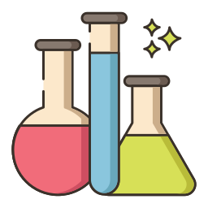
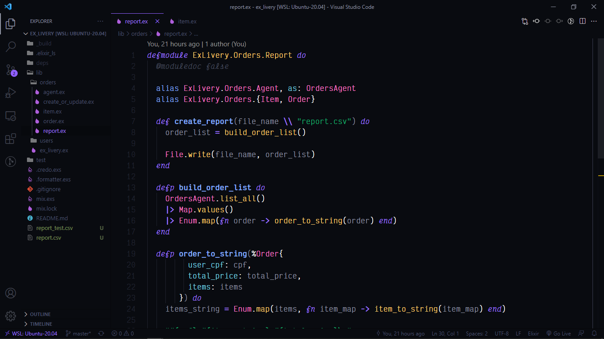
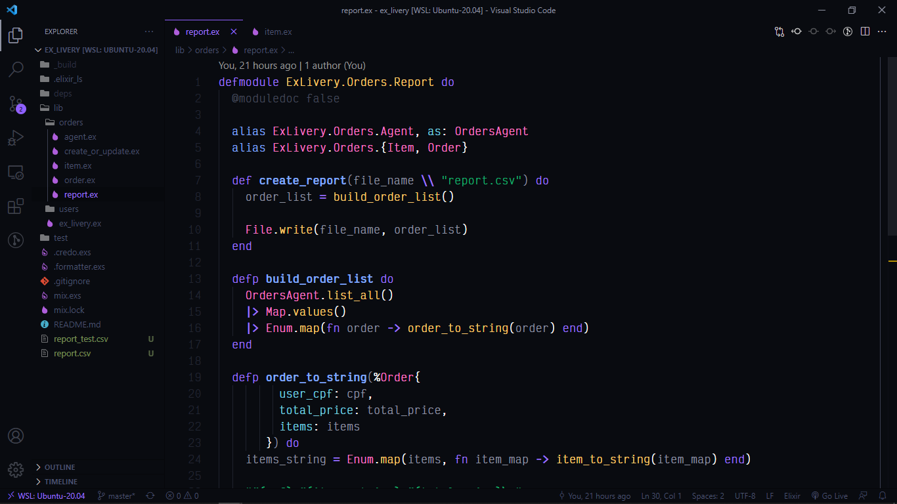

# Elixir Theme

Recommended font: https://rubjo.github.io/victor-mono/

Recommended icon theme: https://bit.ly/3btCSW4

 
<h3>Example with italics</h3>

 
 
<h3>Example no italics</h3>

Made with ♥ by Maiqui Tomé 😀
 

*Reach out to me* 👇

